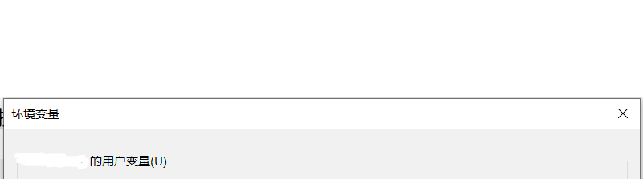

# Homework03 : JDK,JRE,JVM的关系
 1. JDK = JRE + Java开发工具
 2. JRE = JVM + 核心类库 

# Homework04 : 环境变量path配置及其作用
 1. 环境变量的作用是为了在dos的任意目录，可以去使用java 和 javac命令
 2. 先配置 JAVA_HOME = 指向JDK安装目录

用户变量 : 只针对当前用户生效。
  

系统变量 : 只针对所以用户生效。


 3. 再编辑path环  境变量， 增加%JAVA_HOME%(这样增加的好处是当你JAVA目录发生改变时，只用修改  用户 或者  系统变量 中的JAVA_HOME的地址)

# Homework05 : JAVA编写步骤
1. 编写Java源代码
2. javac 编译， 得到对应的 .class字节码文件
3. Java 运行， 本质就是把 .class 加载到 JVM 运行

# Homework06 : JAVA编写7个规范
1. 类，方法的注释， 使用 Javadoc 的方法， 即文档注释
2. 非Javadoc注释，往往是对代码的说明(给程序的维护者)， 说明如何修改，注意事项
3. 使用 ```Tap ``` ，整体将代码右移， 使用 ``` Shift + Tap ``` 整体左移
4. 运算符和 = 的两边， 给空格， 代码看上去清楚 ```int n = 1 + 4 ; ```
5. 源码文件使用 ``` utf-8 ``` 编码
6. 行宽字符不要超过 80
7. 代码编码风格有两种 <font color = blue> 次行风格 </font>， <font color = blue>行尾风格</font>(推荐)
```
尾行风格 : 
public ArrayList(int initialCopacity){
if (initialCapcity > 0) {
    this.elementData = new Object[initialCapcity];}else if (initialCapacity == 0){
        this.elementData = EMPTY_ELEMENTDATA;
    } else {
        throw new IllegalArgumentException("Illegal Capacity: " + initialCapacity);
    }
}
```
```
次行风格 :
public ArrayList(int initialCopacity)
{
if (initialCapcity > 0) 
{
    this.elementData = new Object[initialCapcity];}else if (initialCapacity == 0)
    {
        this.elementData = EMPTY_ELEMENTDATA;
    } else 
    {
        throw new IllegalArgumentException("Illegal Capacity: " + initialCapacity);
    }
}

```

    


# Homework07 : 初学者java易犯错误
1. 编译或者运行时，找不到文件 ````  javac Hello.java``` ，把文件名或者目录找对
2. 主类名和文件名不一致，修改时保持一致
3. 缺少```;```
4. 拼写错误，比如 ```1 -> l 0 -> O , void -> viod```，要求写代码的时，一定小心